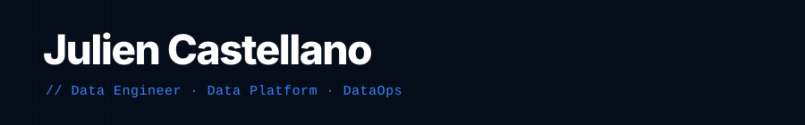

Focalisé sur la mise en production d'architectures Lakehouse et les pratiques DataOps.

---

## Projet en production

**[Vélib Lakehouse](https://julien-castellano.fr/projets/velib-lakehouse)** — Pipeline lakehouse complet sur VPS.  
Ingestion Vélib · MinIO · dbt · DuckDB · Dagster · FastAPI — tourne toutes les 10 minutes.

---

## Stack

